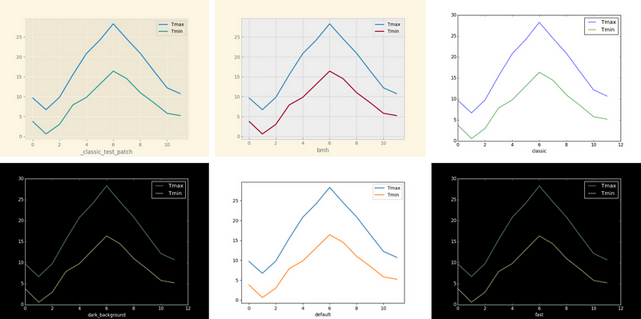
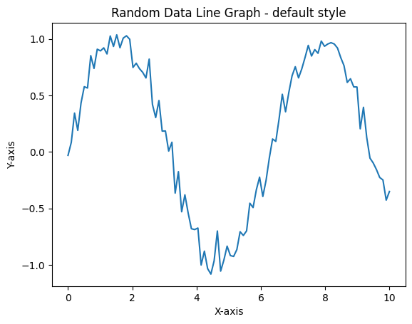
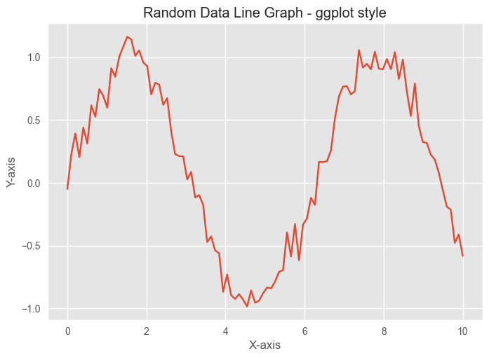

# How to Style Matplotlib Plots and Charts
## Customize your Pandas plots with off-the shelf style sheets - or design your own



Web sites, publications and news sources all have their own styles. Take a look at the financial data published by, say, the BBC or The NewYork Times. Or polling data on Nate Silver's FiveThirtyEight web site. They each have a clear and consistent look.

We are going to look at how we can achieve something similar with our Pandas charts and plots. First, by using the built-in styles that are available to us and then by looking at how we can create our own customizations.

The default style renders a line graph like the image, below. It's a clean-looking image but there are several more built-in styles if you prefer something different.



The styles available a stored in a list in the *Mathplotlib* library. First, we need to import the library and, we'll import *numpy* at the same time as we will use this shortly.


```python
import matplotlib.pyplot as plt
import numpy as np
```

The styles are in ``plt.style.available`` - the code below prints a neat list of the styles.


```python
styles = plt.style.available
for style in styles:
    print(style)
```

    Solarize_Light2
    _classic_test_patch
    _mpl-gallery
    _mpl-gallery-nogrid
    bmh
    classic
    dark_background
    fast
    fivethirtyeight
    ggplot
    grayscale
    petroff10
    seaborn-v0_8
    seaborn-v0_8-bright
    seaborn-v0_8-colorblind
    seaborn-v0_8-dark
    seaborn-v0_8-dark-palette
    seaborn-v0_8-darkgrid
    seaborn-v0_8-deep
    seaborn-v0_8-muted
    seaborn-v0_8-notebook
    seaborn-v0_8-paper
    seaborn-v0_8-pastel
    seaborn-v0_8-poster
    seaborn-v0_8-talk
    seaborn-v0_8-ticks
    seaborn-v0_8-white
    seaborn-v0_8-whitegrid
    tableau-colorblind10
    

Above is the list from my installation which is the version 3.10.0 of Matplotlib.

Many of the styles have been created for the plotting package Seaborn but you can use them with any plotting library that is based on mathplotlib.

Other styles are emulations of other plotting systems or web sites. The ggplot style is based on the the ggplot2 library that is commonly used in the R language.

Below there is a function that can be used to explore the different styles. It is a function that generates some pseudo-random data and then plots a line graph in Matplotlib. We can pass a style as a parameter to it.

Two Numpy sequences are created for the two axes ``x`` and ``y``. ``x`` is created using ``np.linspace(0, 10, 100)``, which generates 100 evenly spaced values between 0 and 10.
``y`` is created by taking the sine of ``x`` values and adding some random noise to it using ``np.random.normal(0, 0.1, 100)``, which generates 100 random values from a normal distribution with a mean of 0 and a standard deviation of 0.1.

The result example use shows a plot with the ``seaborn-v0_8`` style.

Here what the ``ggplot`` style looks like.


```python
plot_with_style('ggplot')
```


    

    


```python
import matplotlib
matplotlib.__version__

```


    '3.10.0'


